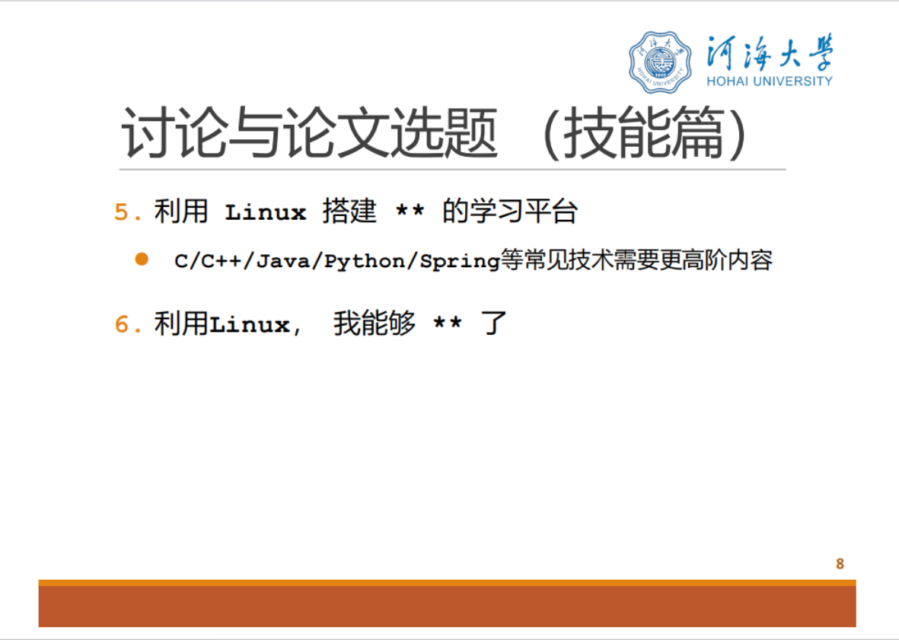

## 待选方向

### 利用Linux, 我能够搭建流媒体服务器

**工具**: 一台Linux服务器($\begin{aligned}&Dell\ Inspiron\ 5447 \\&i5-4210U \\&3.7GiB \end{aligned}$), 几台测试机(数台安装obs直播推流及安装vlc或plot player测试拉流的电脑和一台树莓派5摄像头推流)

**思路**: 在`docker`中搭建一个添加`http-flv`模块的`nginx`容器作为直播推流平台, 可能支持前端播放

**待办**: 

- `docker`使用及`dockerfile`编写 $\textcolor{red}{已完成}$
- 使用`cmake`编译安装`nginx`和`ffmpeg`及`h264`支持 $\textcolor{red}{已完成}$
- 修改`nginx`配置文件 $\textcolor{red}{已完成}$
- 前端使用flv.js支持http-flv播放 $\textcolor{blue}{可选}$
- 汇报PPT制作及演讲 $\textcolor{red}{已完成}$

